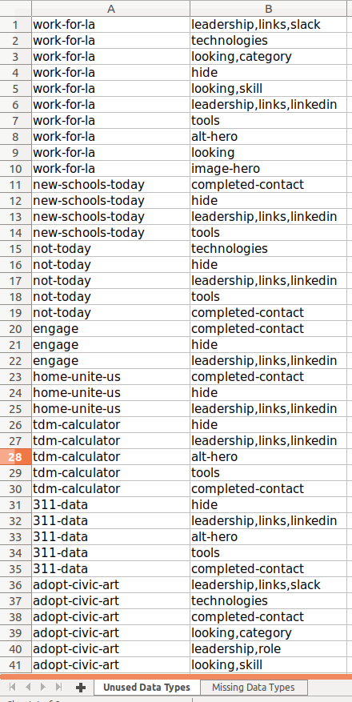

# Gather Data Types - Jekyll

## Description
This project was started to automate a way to identify missing data in Jekyll collections for the HackForLA website. The data in these collections cards are stored in .md files in YAML syntax.

The `gather_data_types.py -i [target_directory]` script iterates through all .md files in a target directory and creates a set of all data types used accross directory. This set is then used by `gather_data_types.py` with other flags to generate a spreadsheet or JSON with unused and missing data types for each file.

The spreadsheet generated will have three sheets. The `All Data Types` sheet will contain all data types present across the collection. The other two sheets are `Unused Data Types` and `Missing Data Types`. A data type is considered to be unused if that data type is not present at all in that .md file. A data type is considered to be missing if one or more nested data types is not present in the .md file while the root data type is present.

Note: Nested data types are represented by comma seperated entries so this script does not support keys with commas at the moment.
For example `one,two,three` would represent:
```
one:
    two:
        three: value
```




#### Validate Through Template
The `gather_data_types.py -t [target_directory]` script parses a local template.md file to generate a set of tracked and ignored data types. This set is then used generate a spreadsheet or JSON with missing and untracked data types for each file in collection.

Example of template.md format
```
---
alt:
alt-hero:
completed-contact:
description:
hide: ignore
identification:
image:
image-hero:
leadership:
  - links:
      github:
      linkedin:
      slack:
    name:
    picture:
    role:
links:
  - name:
    url:
location:
looking:
  - category:
    skill:
partner:
status:
technologies:
title:
tools:
---
```

### Requirements
You need Python 3.x to run the script

You will also need the OpenPyXL library installed.
##### Install OpenPyXL With `pip`
`pip3 install openpyxl`

You will also need the PyYAML library installed.
##### Install PyYAML With `pip`
`pip3 install pyyaml`

### How To Use
We first need to parse all the .md files in target directory and generate a set of used data types. This information will be stored in ./dataTypes.marshal.

#### Generate ./dataTypes.marshal
`python3 gather_data_types -i [target directory]`

Once the ./dataTypes.marshal file is generated you can run the following to generate .xlsx spreadsheet of files and their unused/missing data types.

#### Generate Data Type Spreadsheet
`python3 gather_data_types -x -d [output_directory] -o [output_name]`

If you run this script without the `-d` or `-o` flags the default directory for the output will be your current directory and the file name will be `DataTypes.xlsx`.

Once the ./dataTypes.marshal file is generated you can run the following to generate JSON output.
#### Generate Data Type JSON
`python3 gather_data_types -j`

The JSON will be printed to standerd out

#### Validate Through Template
`python3 gather_data_types -t [target directory]`

Uses ./template.md to generate a set of tracked and ignored data types and then ouputs a report of missing and untracked datat types in target directory. The output is in JSON and ouput to standard out.

`python3 gather_data_types -t [target directory] -x`

Adding the -x flag will omit the JSON output and produce a .xlsx spreadsheet to ./template-data-types.xlsx
